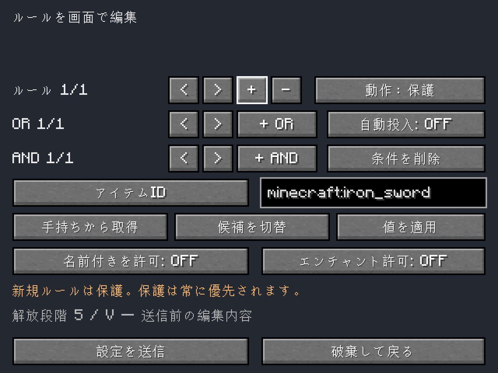

# Internal Furnace / 体内かまど

[English](README.md) · [ダウンロード](https://github.com/n624-dev/internal-furnace/releases) · [遊び方](docs/GUIDE.ja.md) · [開発](docs/DEVELOPMENT.ja.md)

Minecraftのプレイヤーの体内に、**Mine and Slashの成長に合わせて育てるかまど**を追加します。戦闘レベルを条件に、素材とバニラXPで永続強化を購入。実際の精錬レシピを使い、共通の熱量を管理します。

**Beta版:** 初回公開は`0.1.0-beta.1`です。機能の実機検証は実施済みですが、広い環境での互換性や長期的なバランスは引き続き確認します。

## 主な機能

- 炉心7段階と個別46段階の購入。最大4炉室が独立して動作。
- サーバーのレシピを使った精錬・燻製・溶鉱。
- 最大速度2倍、燃費90%、熱量51,200、投入27枠、燃料・出力各18枠。
- 視覚的なAND/OR自動投入ルール、M&S装備の選別、保護ルール。
- 6タブ、日英UI、ドラッグ分配、数字キー・オフハンド交換、特殊アイテムの確認。
- プレイヤーごとの保存、keepInventory両設定への対応、取得時に一度だけ精算する出力XP。

## 導入

**クライアントと専用サーバーの両方に同一のRelease JAR**を入れてください。同じバージョン名でもJARが異なると接続を拒否します。[GitHub Releases](https://github.com/n624-dev/internal-furnace/releases)から取得できます。CurseForgeでの公開は準備予定で、現在このリポジトリからの連携は設定していません。

| 必要な環境 | 対応する固定バージョン |
| --- | --- |
| Minecraft | 1.20.1 |
| Java | 17 |
| Forge | 47.4.10 |
| [Mine and Slash](https://www.curseforge.com/minecraft/mc-mods/mine-and-slash-reloaded) | 6.4.7 |
| [Library of Exile](https://www.curseforge.com/minecraft/mc-mods/library-of-exile) | 2.1.11 |
| [Mowzie's Mobs](https://www.curseforge.com/minecraft/mc-mods/mowzies-mobs) | 1.8.2 |

これらのMODと、それぞれが要求する依存MODを導入してください。依存MODのJARは同梱していません。他のMinecraft版、Fabric/NeoForge、M&Sなしの単体利用、より新しい依存MODは今回のBetaの対応対象外です。

既存worldへBeta版を追加・更新する前にバックアップしてください。ゲーム内で**Vキー**（変更可能）、または`/internalfurnace`で開きます。初回解放にはM&S戦闘レベル10と、強化タブに表示する素材・バニラXPが必要です。M&Sレベルは消費しません。

## ドキュメント

- [遊び方](docs/GUIDE.ja.md): 操作、精錬、熱、成長、自動化、死亡時の仕様。
- [設定](docs/CONFIGURATION.ja.md): 購入価格、ルール、サーバー設定。
- [開発](docs/DEVELOPMENT.ja.md): ビルド、テスト、再現可能な成果物。
- [検証記録](docs/VERIFICATION.ja.md): 確認済みの範囲と限界。
- [Release手順](docs/RELEASING.ja.md): GitHub Actionsと今後の保守。
- [変更履歴](CHANGELOG.ja.md) · [貢献方法](CONTRIBUTING.ja.md) · [第三者ライセンス](THIRD_PARTY_NOTICES.ja.md)

不具合はバージョンと再現手順を添えて[GitHub Issues](https://github.com/n624-dev/internal-furnace/issues)へお願いします。今後のコード編集・GitHub Releaseはこのリポジトリで行います。ReleaseでMinecraftサーバーを自動更新・再起動することはありません。

## ライセンス

独自コードと文書は[MIT](LICENSE)、著作権者は© 2026 n624-devです。第三者の部品やゲーム内コンテンツはそれぞれのライセンスに従います。Minecraft公式製品ではなく、Mojang・Microsoftとの提携はありません。
