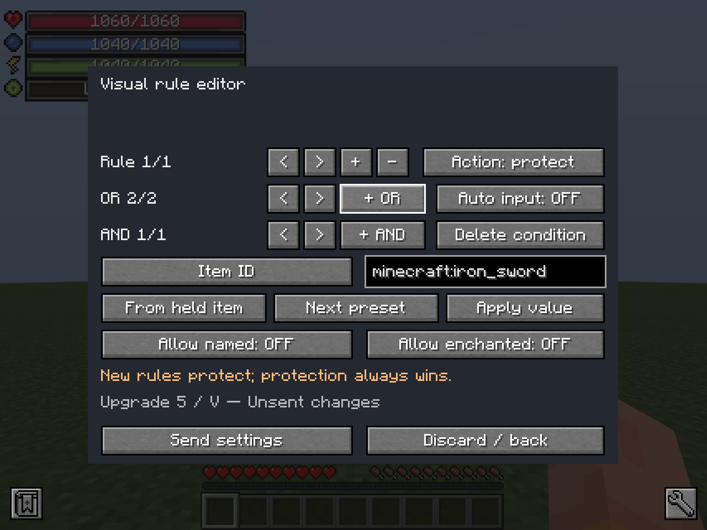

# Internal Furnace

[日本語](README.ja.md) · [Downloads](https://github.com/n624-dev/internal-furnace/releases) · [Player guide](docs/GUIDE.md) · [Development](docs/DEVELOPMENT.md)

An upgradeable furnace inside your Minecraft character, designed around **Mine and Slash progression**. Buy permanent upgrades with combat-level requirements, materials and vanilla XP; smelt through real Minecraft recipes while managing a shared heat reserve.

**Beta:** the initial public release is `0.1.0-beta.1`. Functional integration tests have passed; broader compatibility and long-term balance are still being evaluated.

## Features

- Seven core ranks and 46 individual upgrade purchases; up to four independent chambers.
- Smelting, smoking and blasting using the server's recipes.
- Up to 2× speed, 90% fuel efficiency, 51,200 heat, 27 queue slots and 18 fuel/output slots each.
- Visual AND/OR automation rules, Mine and Slash equipment filters and protection rules.
- Six tabs, English/Japanese UI, drag distribution, hotbar/offhand swaps and special-item confirmation.
- Persistent player data, both keepInventory death modes and output XP paid once on collection.

## Install

Install the **same release JAR on both client and dedicated server**. An unequal JAR is rejected even if its version name is the same. Download from [GitHub Releases](https://github.com/n624-dev/internal-furnace/releases); CurseForge publication is planned but is not currently configured here.

| Requirement | Exact supported version |
| --- | --- |
| Minecraft | 1.20.1 |
| Java | 17 |
| Forge | 47.4.10 |
| [Mine and Slash](https://www.curseforge.com/minecraft/mc-mods/mine-and-slash-reloaded) | 6.4.7 |
| [Library of Exile](https://www.curseforge.com/minecraft/mc-mods/library-of-exile) | 2.1.11 |
| [Mowzie's Mobs](https://www.curseforge.com/minecraft/mc-mods/mowzies-mobs) | 1.8.2 |

Install those MODs and their own required dependencies. This JAR contains none of them. Other Minecraft versions, Fabric/NeoForge, standalone use without Mine and Slash, and newer dependency versions are not supported by this beta.

Back up an existing world before adding or replacing a beta MOD. Start the game, press **V** (rebindable), or run `/internalfurnace`. The first rank requires M&S combat level 10 plus the materials and vanilla XP shown in the upgrade tab. M&S levels are a requirement and are not spent.

## Documentation

- [Player guide](docs/GUIDE.md): controls, recipes, heat, progression, automation and death.
- [Configuration](docs/CONFIGURATION.md): costs, rules and server settings.
- [Development](docs/DEVELOPMENT.md): builds, tests and reproducible artifacts.
- [Verification](docs/VERIFICATION.md): executed checks and their limits.
- [Releasing](docs/RELEASING.md): GitHub Actions and future maintenance.
- [Changelog](CHANGELOG.md) · [Contributing](CONTRIBUTING.md) · [Third-party notices](THIRD_PARTY_NOTICES.md)

Report bugs in [GitHub Issues](https://github.com/n624-dev/internal-furnace/issues), including versions and reproduction steps. This repository is the upstream for future code changes and GitHub releases. Releases do not deploy or restart a Minecraft server.

## License

Original project code and documentation: [MIT](LICENSE), copyright © 2026 n624-dev. Third-party components and game content retain their own licenses. Not an official Minecraft product; not affiliated with Mojang or Microsoft.
